<style type="text/css">
  h2{
  font-size: 12pt;
}

  h3{
  font-size: 8pt;
}

  h1.title{
  font-size: 30pt;
  color: DarkBlue;
}
</style>
---
Tracking Economic Consequences and Responses to COVID-19 in Bangladesh. Access to information on key economic indicators is essential to help policy-makers in Bangladesh respond to the Covid-19 pandemic. The following dashboard provides data on current economic conditions and trends from administrative and phone based survey in Bangladesh.
```{r setup, include=FALSE}
knitr::opts_chunk$set(echo = TRUE)
```
<<<<<<< HEAD
[^1^]: Collaborative effort between the a2i and Y-RISE
=======
[^1^]: Collobarative effort between the a2i and Y-RISE
>>>>>>> ceb4d1056c2d087b455d068f3b94836eadd67ed8

#  {.tabset .tabset-pills} 
## Food Security & Market Access {.tabset  .tabset-pills}

### Trends
> Percentage of Households Skipping Meals

```{r , echo=FALSE, fig.cap="Changes in food insecurity compared to the previous year, Northern Bangladesh (NLS)", out.width = '50%'}
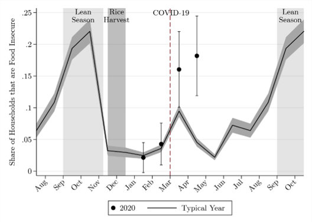
```

```{r , echo=FALSE, fig.cap="Reported food insecurity in [April] across multiple samples", out.width = '50%'}
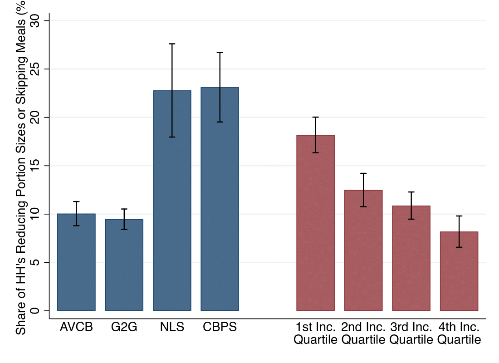
```


```{r , echo=FALSE, fig.cap="Reported market closures in [April] across multiple samples", out.width = '50%'}
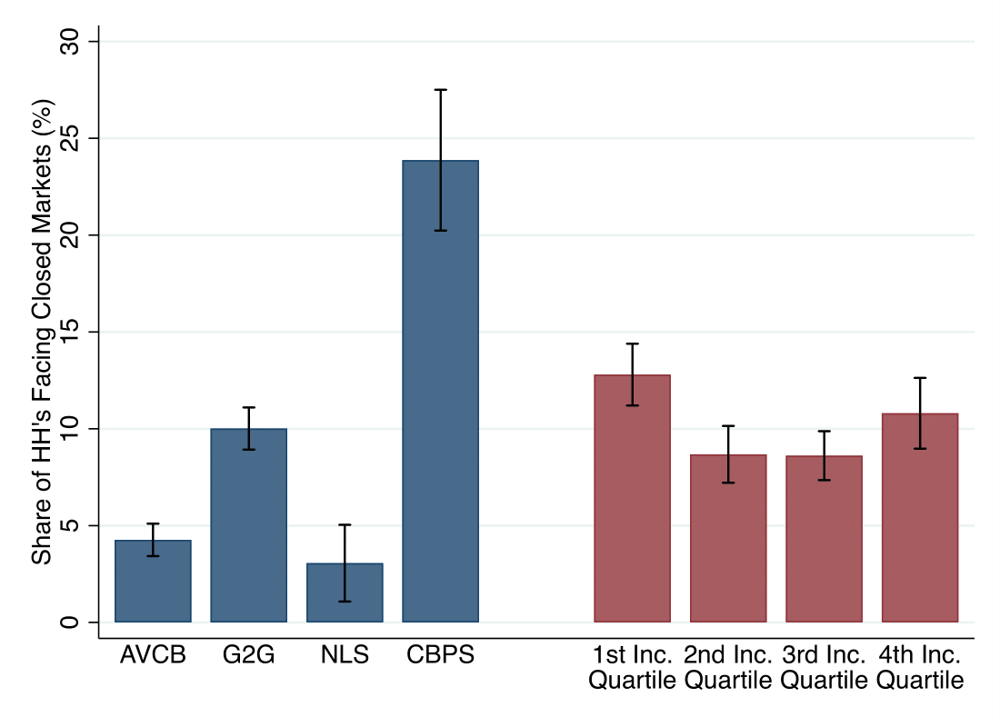
```

> Change in commodity prices over time

```{r , echo=FALSE, fig.cap="Daily district level market price of aman (coarse) rice", out.width = '50%'}
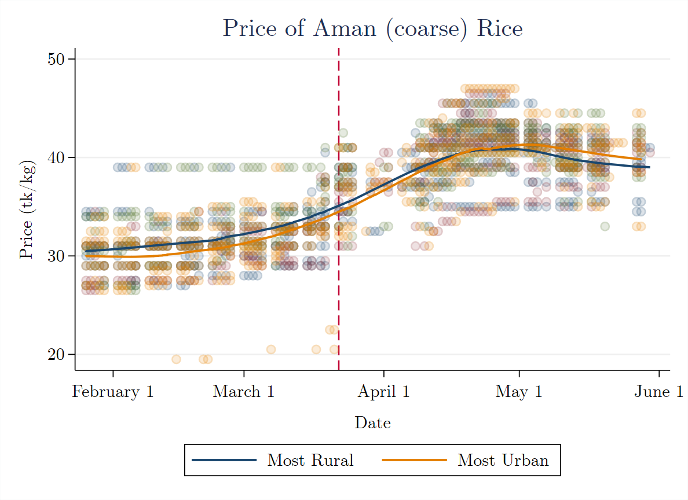
```

```{r , echo=FALSE, fig.cap="Daily district level market price of local masur", out.width = '50%'}
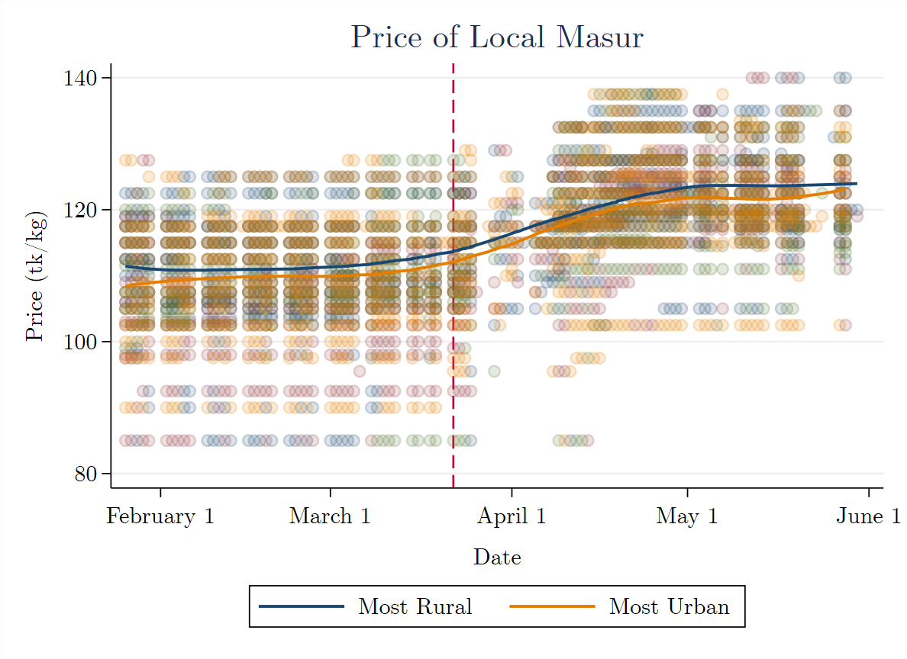
```

```{r , echo=FALSE, fig.cap="Daily district level market price of onions", out.width = '50%'}
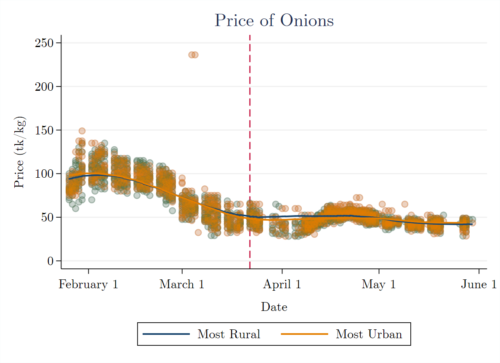
```

```{r , echo=FALSE, fig.cap="Daily district level market price of potatoes", out.width = '50%'}
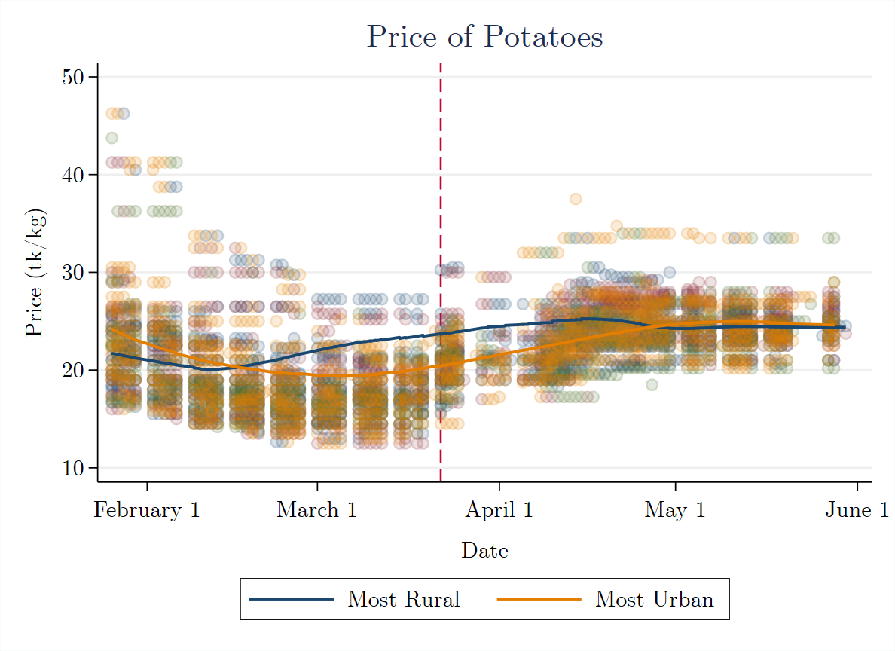
```

### Maps

### Definition of Measures

Data definitions:  

Measure  | Definition | Value Range
------------- | ------------- | -------------
%hh able to buy essential food items (compare to  previous week)  | Content Cell | Content Cell
Amount of rice bought last time  | Content Cell | Content Cell
Amount of lentil bought last time  | Content Cell | Content Cell
Amount of onion bought last time  | Content Cell | Content Cell
Amount of potato bought last time  | Content Cell | Content Cell
Share HH facing market closure  | Content Cell | Content Cell


## Income Effect {.tabset  .tabset-pills}

### Trends


```{r , echo=FALSE, fig.cap="Changes in monthly income before and after COVID-19 lockdown", out.width = '50%'}
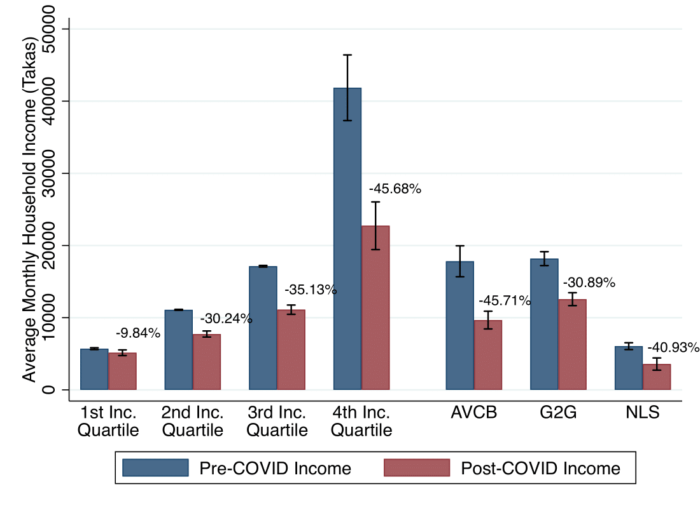
```


### Maps

### Definition of Measures
Data definitions:  

Measure  | Definition | Value Range
------------- | ------------- | -------------
Difference in monthly income  | Content Cell | Content Cell
xx  | Content Cell | Content Cell

## Exposure to Migration {.tabset  .tabset-pills}

### Trends
> Food security for migrant households

```{r , echo=FALSE, fig.cap="A caption", out.width = '50%'}
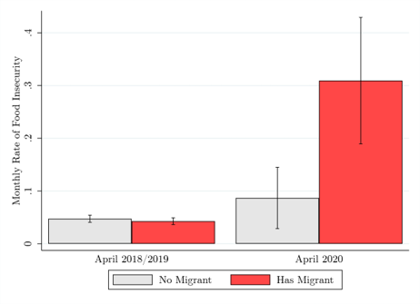
```

```{r , echo=FALSE, fig.cap="A caption", out.width = '50%'}
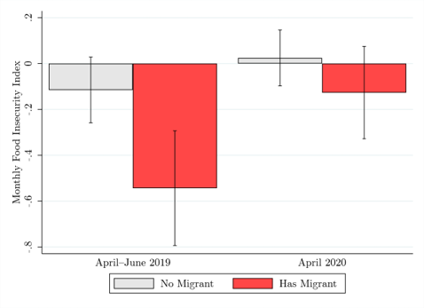
```
> Change in income for migrant households

```{r , echo=FALSE, fig.cap="A caption", out.width = '50%'}
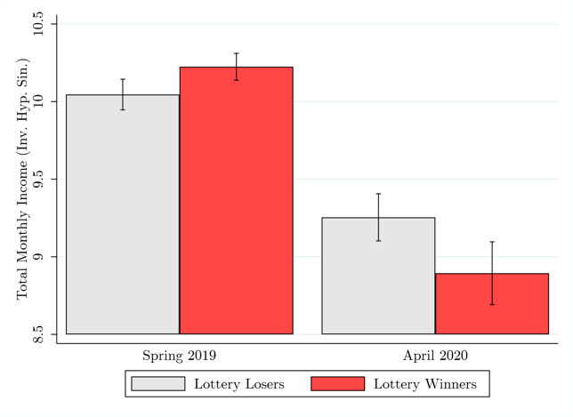
```


### Maps


```{r , echo=FALSE, fig.cap=" ", out.width = '60%'}
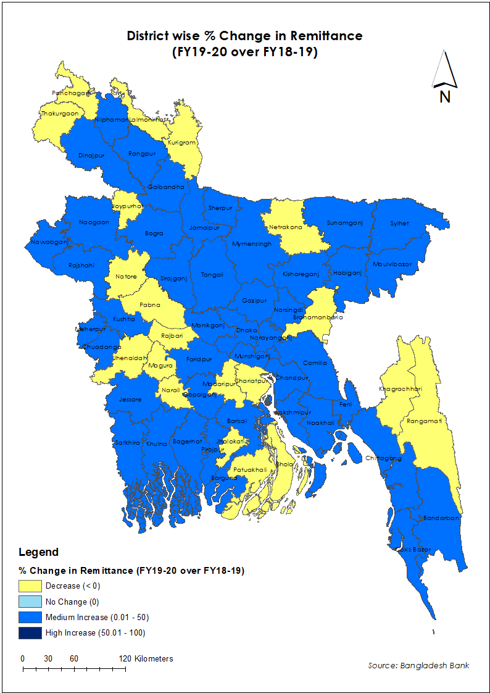
```

### Definition of Measures

Data definitions:

Measure  | Definition | Value Range
------------- | ------------- | -------------
Food security  | Content Cell | Content Cell
Change in household income  | Content Cell | Content Cell
Percentage of migration  | Content Cell | Content Cell
Percentage change in remittance  | Content Cell | Content Cell


### Policy Briefs
* [Using Migration Patterns to Predict COVID-19 Risk Exposure in Developing Countries](https://yrise.yale.edu/using-migration-patterns-to-predict-covid-19-risk-exposure-in-developing-countries/)  

* [Migration and the Labor Market Impacts of COVID-19](https://yrise.yale.edu/migration-and-the-labor-market-impacts-of-covid-19/)  

## Social Transfers {.tabset  .tabset-pills}

### Trends


```{r , echo=FALSE, fig.cap="Reported receipts of Government or NGO aid in [April] across multiple samples", out.width = '50%'}
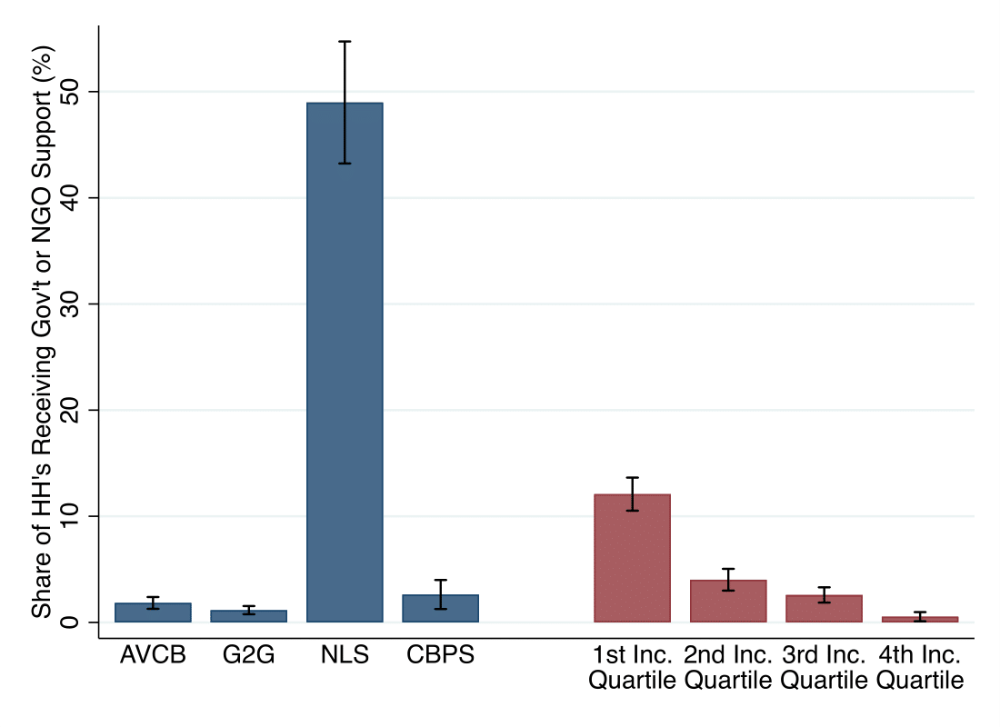
```

### Maps

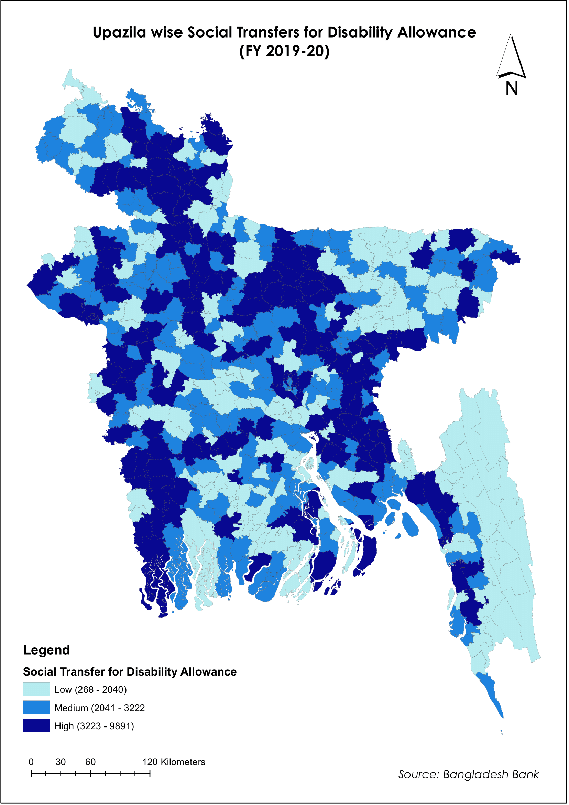{width=30%} 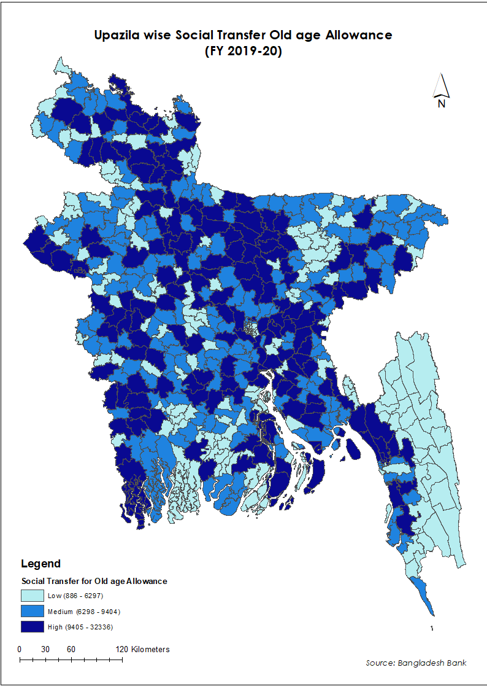{width=30%}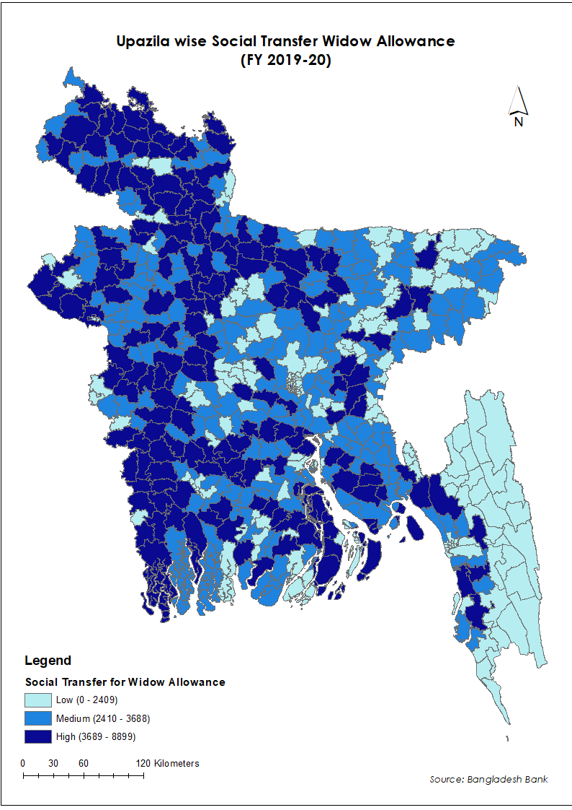{width=30%}

### Definition of Measures

Data definitions:

Measure  | Definition | Value Range
------------- | ------------- | -------------
Number HHs receiving social transfers/allowances  | Content Cell | Content Cell
Percentage of households receiving support from NGO/Govt for Covid-19 | Content Cell | Content Cell
xx  | Content Cell | Content Cell


## COVID-19 Awareness/Symptoms {.tabset  .tabset-pills}


### Trends


```{r , echo=FALSE, fig.cap="Percentage of households selling assets to deal with Covid", out.width = '50%'}
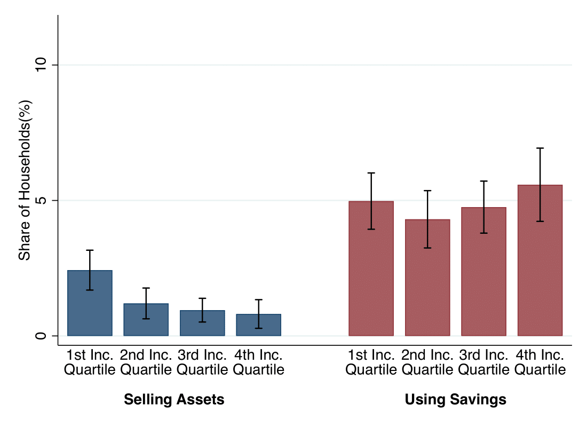
```

> Percentage of people wearing mask

> Percentage of people and/or household members experienced any of the symptoms in the past 2 weeks

> Percentage of people attending prayers 

> Percentage of people attending social gatherings

### Maps

### Definition of Measures
Measure  | Definition | Value Range
------------- | ------------- | -------------
Percentage of households selling assets to deal with Covid | Content Cell | Content Cell
Percentage of people wearing mask  | Content Cell | Content Cell
Percentage of people and/or household members experienced any of the symptoms in the past 2 weeks  | Content Cell | Content Cell
Percentage of people attending prayers  | Content Cell | Content Cell
Percentage of people attending social gatherings | Content Cell | Content Cell


## All Policy Briefs {.tabset  .tabset-pills}
* [Using Migration Patterns to Predict COVID-19 Risk Exposure in Developing Countries](https://yrise.yale.edu/using-migration-patterns-to-predict-covid-19-risk-exposure-in-developing-countries/)  

* [Migration and the Labor Market Impacts of COVID-19](https://yrise.yale.edu/migration-and-the-labor-market-impacts-of-covid-19/)  

* [Should Low-Income Countries Impose the Same Social Distancing Guidelines as Europe and North America to Halt the Spread of Covid-19?](https://yrise.yale.edu/should-low-income-countries-impose-the-same-social-distancing-guidelines-as-europe-and-north-america-to-halt-the-spread-of-covid-19/)  

* [Prevalence of COVID-19 symptoms, risk factors, and health behaviors in host and refugee communities in Cox’s Bazar: a representative panel study](https://yrise.yale.edu/prevalence-of-covid-19-symptoms-risk-factors-and-health-behaviors-in-host-and-refugee-communities-in-coxs-bazar-a-representative-panel-study/)  

* [Changes in Religious Gatherings & Practices to Curb COVID-19](https://yrise.yale.edu/changes-in-religious-gatherings-practices-to-curb-covid-19/)
