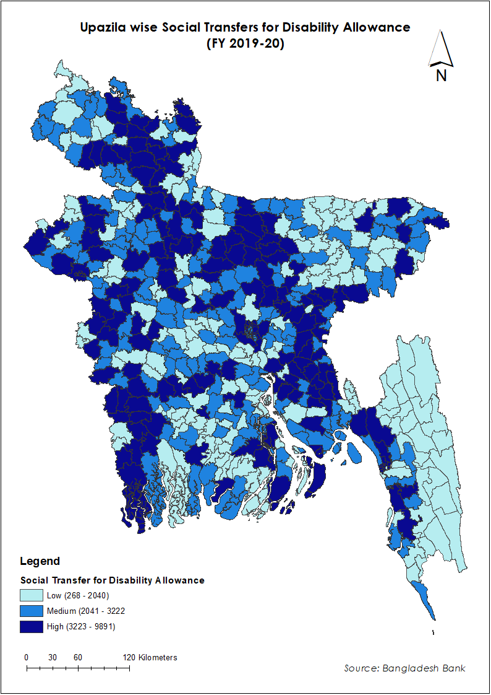

Tracking Economic Consequences and Responses to COVID-19 in Bangladesh

Access to information on key economic indicators is essential to help policy-makers in Bangladesh respond to the Covid-19 pandemic.

The dashboard provides data on current economic conditions and trends from administrative and phone based survey in Bangladesh.
```{r setup, include=FALSE}
knitr::opts_chunk$set(echo = TRUE)
```


#   Socio-economic indicators {.tabset .tabset-pills} 
## Food Security & Market Access {.tabset  .tabset-pills}

### Trends
% hh Skipping Meals

```{r , echo=FALSE, fig.cap="A caption", out.width = '70%'}

```

%hh able to buy essential food items (compare to  previous week)

Amount of rice, lentil, onion and potato bought last time

Share HH facing market closure

```{r , echo=FALSE, fig.cap="A caption", out.width = '70%'}

```

Change in commodity prices over time

```{r , echo=FALSE, fig.cap="A caption", out.width = '70%'}
knitr::include_graphics("figures/aman_coarse.png")
```

```{r , echo=FALSE, fig.cap="A caption", out.width = '70%'}
knitr::include_graphics("figures/masur_local.png")
```

```{r , echo=FALSE, fig.cap="A caption", out.width = '70%'}

```

```{r , echo=FALSE, fig.cap="A caption", out.width = '70%'}

```

### Maps

### Definition of Measures

## Income Effect {.tabset  .tabset-pills}

### Trends
Difference in monthly income
(show breakdown by source)

```{r , echo=FALSE, fig.cap="A caption", out.width = '70%'}
knitr::include_graphics("figures/pre_post_income.png")
```

```{r , echo=FALSE, fig.cap="A caption", out.width = '70%'}
knitr::include_graphics("figures/sell_assets_use_savings_2.png")
```

### Maps

### Definition of Measures

## Exposure to Migration {.tabset  .tabset-pills}

### Trends
Food security 

Change in income

% migrate (by district)

% return (by district) – jan-march

YoY Change in Remittance (by district)


### Maps

### Definition of Measures

## Social Transfers {.tabset  .tabset-pills}

### Trends
Number HHs receiving support

Value of the support provided

%hh receiving support from NGO/Govt for Covid-19 

```{r , echo=FALSE, fig.cap="A caption", out.width = '70%'}
knitr::include_graphics("figures/ngo_gov_sprt.png")
```

### Maps

```{r , echo=FALSE, fig.cap="A caption", out.width = '70%'}

```

```{r , echo=FALSE, fig.cap="A caption", out.width = '70%'}

```

```{r , echo=FALSE, fig.cap="A caption", out.width = '70%'}
knitr::include_graphics("figures/widow allowance_fy19-20.png")
```

### Definition of Measures

## COVID-19 Awareness/Symptoms {.tabset  .tabset-pills}

### Trends
%people wearing mask

%people attend prayers at

%people attend social gatherings

% selling assets to deal with Covid

% people and/or household members experienced any of the symptoms in the past 2 weeks
### Maps

### Definition of Measures

